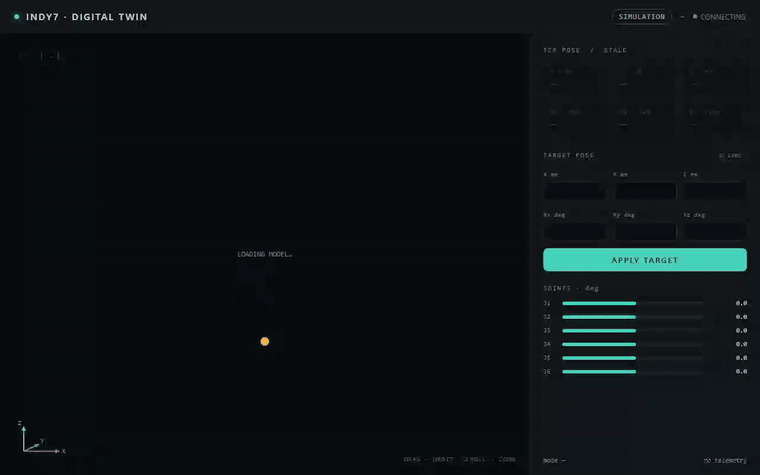
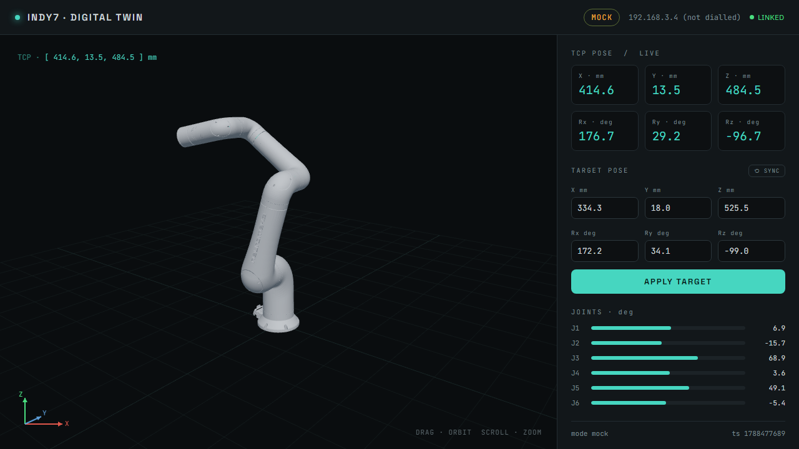
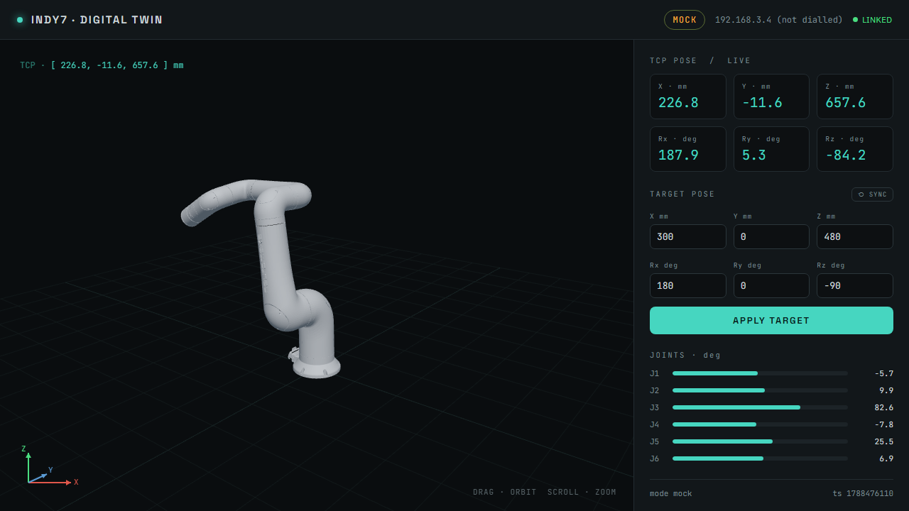

# Indy7 Digital Twin — P0 MVP

[](https://github.com/woogijeong/digital_twin2/actions/workflows/ci.yml)
[](backend/pyproject.toml)
[](package.json)
[](backend/app/main.py)
[](frontend/package.json)
[](frontend/src/three)
[](LICENSE)

A browser-based digital twin of the Neuromeka **Indy7** collaborative robot.
Loads the real `indy_description` URDF into a three.js viewport, shows the live
TCP pose (X, Y, Z, Rx, Ry, Rz), and lets you type a target pose — absolute in
the base frame, or a relative offset from the current pose — that the controller
solves with inverse kinematics and the model animates to.

Design direction: **"Control Room"** — a dark industrial HMI (see
`.omc/plans/2026-09-03-neuromeka-digital-twin-p0.md` §8).



> Orbit the model, drive it to two target poses (IK solved on the controller),
> then an unreachable target is rejected inline. Mock mode — no controller
> attached. Regenerate with `pnpm demo:gif`.


> Mount the gripper, descend onto the workpiece, close to pick it up, carry it
> to a new spot, and open to place it down. Mock mode. Regenerate with
> `pnpm demo:pickplace:gif`.

<details>
<summary>Static screenshots</summary>



| Target applied (IK solved) | Unreachable target rejected |
| --- | --- |
|  |  |

</details>

## P0 이후 업데이트 내역

P0 MVP 이후 추가된 기능들입니다 (한국어로 정리):

- **Pick / Place 시각화** — 바닥에 놓인 워크피스를 그리퍼로 잡았다 놓을 수 있습니다. 그리퍼 팁이 물체 근처(8cm 이내)에서 닫히면 부착되어 팔을 따라 이동하고, 열면 그 자리에 놓입니다.
- **안전 경고** — 목표 좌표가 바닥면(Z < 5mm) 아래일 경우 IK 단계에서 아예 거부되고(사후 경고가 아니라 사전 차단), 관절이 하드웨어 한계에 근접하면 JOINTS 바가 노란색으로 강조됩니다.
- **TOOL 좌표계 이동 모드** — TARGET POSE에 `ABS`/`REL`에 이어 `TOOL` 모드가 추가되어, 툴이 현재 향하고 있는 방향을 기준으로 전진/후진(접근·후퇴)하거나 툴 자신의 축으로 회전시킬 수 있습니다.
- **엔드 이펙터 커스터마이징** — 그리퍼/석션 각각 색상을 자유롭게 지정할 수 있고(몸통+접촉부 전체 반영), 어두운 배경에서도 잘 보이도록 teal 색 윤곽선(림 라이트)이 둘러져 있습니다. 실측값 반영: 그리퍼 전장 110mm, 석션 전장 210mm.
- **다크 / 라이트 모드 & 뷰포트 배경 전환** — 헤더에서 UI 전체를 라이트/다크로 전환할 수 있고, 3D 뷰포트 배경도 검정/회색 중 선택할 수 있습니다(그리드 색상도 배경에 맞춰 자동 보정). 3D 시야 자체는 항상 어둡게 유지되어 오버레이(TCP 좌표, 방향 기즈모 등)의 가독성은 그대로 보장됩니다.
- **정확한 연결 상태 표시** — 헤더의 `LINKED`/`NOT LINKED` 배지가 이제 "텔레메트리가 흐르는지"가 아니라 "실제 로봇 컨트롤러에 연결되어 있는지"만을 나타냅니다. mock 모드에서는 항상 `NOT LINKED`로 표시됩니다.
- **Manipulability(가동성 지수) 표시 + 컨트롤러 에러 복구** — 하단에 실시간 manipulability(자코비안 기반, 특이점에 가까울수록 0에 수렴)가 표시됩니다. 실제 컨트롤러가 충돌(COLLISION)이나 안전 위반(VIOLATE) 상태가 되면 TARGET POSE 패널에 경고 배너와 `RECOVER` 버튼이 나타나며, 이 버튼은 fault 플래그만 해제할 뿐 모션 명령이 아닙니다.
- **그리퍼 / 석션 디지털 출력 제어** — 화면의 OPEN/CLOSE, ON/OFF 버튼이 실제 컨트롤러 연결 시 디지털 출력(DO0/DO1 = 그리퍼 열기/닫기, DO2 = 석션 on/off)을 그대로 토글합니다. 로봇 팔 자체를 움직이는 명령이 아니라 엔드 이펙터 밸브만 작동시키므로, 아래 "P0 never commands motion" 원칙과 별개로 안전하게 허용되어 있습니다. 연결 시 그리퍼/석션의 실제 DO 상태를 읽어와 화면(버튼 하이라이트·3D 손가락)에 반영합니다.
- **컨트롤러 상태를 바꾸지 않는 연결** — 트윈은 연결할 때 `set_simulation_mode`를 호출하지 않습니다. 컨트롤러가 어떤 모드든 그대로 두고 관찰만 하며, 실제 모드(`sim_mode`)를 텔레메트리로 받아 헤더에 `SIMULATION` / `LIVE`로 표시합니다. 모션 차단은 `_call` 허용 목록이 담당합니다. 툴 미선택 시 연결만으로 `set_tool_frame`을 쓰던 것도 제거했습니다.
- **컨트롤러 링크 끊김 / fault 가시화** — 실기 gRPC 연결이 끊기면 화면이 마지막 프레임에 멈추지 않고 상단·헤더·패널에 "CONTROLLER LINK LOST" 경고를 표시하며 2초 간격으로 자동 재연결합니다. `op_state` fault도 VIOLATE/COLLISION 외에 E-stop·전원 off·수동복구 등을 사람이 읽을 수 있는 메시지로 표시합니다. 물리 로봇 팔 미연결(`is_robot_connected: false`)은 이 컨트롤러 셋업의 정상 상태라 경고가 아니라 하단 상태줄에 "arm offline"으로만 조용히 표시합니다.
- **ALL DO OFF 버튼** — END EFFECTOR 패널 하단의 버튼 하나로 트윈이 다루는 모든 엔드 이펙터 디지털 출력(DO0·DO1 그리퍼 솔레노이드, DO2 석션 밸브)을 한 번에 LOW로 내립니다. 화면의 그리퍼/석션 표시도 함께 초기화됩니다.
- **비상정지(E-STOP) 버튼** — 헤더의 빨간 `■ E-STOP` 버튼이 `stop_motion`(category-1, 제어 감속 후 브레이크)으로 컨트롤러 모션을 즉시 정지시킵니다. 동시에 진행 중인 IK 애니메이션을 취소해 화면상 팔도 버튼 누르는 즉시 멈춥니다. 이것은 트윈이 컨트롤러를 명령하는 **유일한 예외**입니다 — 모션을 *멈추기만* 하며 절대 시작시키지 않고, 실물 로봇을 지켜보는 작업자에게 필요한 안전 장치이기 때문입니다. 정지 후 컨트롤러가 보고하는 STOP 상태는 기존 fault 배너 + `RECOVER` 버튼으로 처리됩니다.
- **모션 시퀀스 재생 (mock 전용)** — 실기에 연결되지 않은 mock 모드에서, 사이드바의 `MOTION SEQUENCE` 패널에 JSON 스텝 배열을 붙여넣고 3D 트윈이 스텝을 따라 움직이는 걸 재생할 수 있습니다. `PLAY / PAUSE / STEP / RESET` + 배속(0.5×~4×), 현재 스텝 하이라이트. 스텝 종류: `movej`, `movel`(abs/rel/tool 프레임), `gripper`, `suction`, `wait`, `home`, `tool`. PLAY를 누르면 먼저 컴파일하며 모든 이동을 IK로 미리 풀어, 도달 불가·바닥 침범 같은 문제를 `step N: …`로 재생 전에 알려줍니다. 모션 엔드포인트는 호출하지 않고 `/api/ik`(컴파일)과 `/api/home`(RESET)만 사용하며, 실기 연결 시 PLAY는 비활성화됩니다 (RESET TO HOME이 real 모드에서 잠기는 것과 동일). **형식 명세·파이썬 변환 방법·AI 프롬프트: [`docs/motion-sequence-format.md`](docs/motion-sequence-format.md), 붙여넣기용 예시: [`docs/sequences/`](docs/sequences/).**
- **참조 팔레트 모델 + on/off** — `pallet_corners.json`으로 실측한 팔레트(base 기준 190mm 정사각, 상단 z=184.5mm)를 3D 뷰포트에 배치합니다. GLB 모델을 자동 스케일해 측정 위치에 놓고, 상판 4모서리(픽 지점)에 청록 핀을 표시하며, 바닥까지 받침 블록을 채웁니다. 헤더의 `▨ PALLET` 버튼으로 표시/숨김을 토글하며 브라우저에 저장됩니다. 씬 장식이라 mock·real 양쪽에서 보이고, 모델 로드에 실패해도 로봇 렌더링은 막지 않습니다.
- **mock IK 가동 범위 확대** — 오프라인 mock의 수치 IK 솔버(`backend/app/robot/kinematics.py`)가 시드 구성을 넓히고, 관절 한계를 ±360° 래핑으로 회복하며, 허용 오차를 0.05mm/0.01°에서 0.5mm/0.2°로 완화했습니다(시각 트윈에 μm 정밀도는 불필요). 무작위 도달 가능 포즈 회수율이 67% → ~97%로 올랐습니다. 여전히 국소 최소값에 빠지는 극단적 기울임 자세는 실컨트롤러의 해석적 IK(`inverse_kin`)를 쓰세요.

## 실행 방법 (한국어)

```bash
# 최초 1회
pnpm install
pnpm --dir frontend install
uv sync --project backend
# pnpm assets   # 선택 사항 — Indy7 URDF/메시는 이미 저장소에 포함되어 있어
                # 원본을 다시 받아올 때만 실행하면 됩니다

# 백엔드(:8000) + 프론트엔드(:5173) 동시 실행
pnpm dev              # -> http://localhost:5173 접속
```

- 컨트롤러 없이 강제로 mock 모드 실행: `INDY_USE_MOCK=1 pnpm dev`
- 다른 컨트롤러 IP로 접속: `INDY_HOST=10.0.0.5 pnpm dev`
- 실제 로봇 컨트롤러(192.168.3.4)가 네트워크에 없으면 자동으로 mock 모드로 전환되며, 헤더에 `MOCK` 배지가 표시됩니다. 화면 상단의 CONNECT 버튼으로 언제든 실제 컨트롤러 IP를 입력해 연결을 시도할 수 있습니다.
- 테스트 전체 실행: `pnpm test` (백엔드 pytest + 프론트엔드 빌드 + Playwright e2e)

## 로컬 실행 가이드 (한국어)

### 요구사항
- Node.js ≥ 22, pnpm (`npm i -g pnpm`)
- [uv](https://docs.astral.sh/uv/) — Python 3.12 백엔드 환경을 자동으로 관리 (neuromeka SDK의 gRPC 의존성이 3.13+ 휠을 제공하지 않아 3.12 고정 필요)
- 컨트롤러(기본 `192.168.3.4`)가 연결되어 있지 않아도 `MockRobot`으로 자동 폴백되므로 실행 자체는 가능

### 실행 순서
1. **저장소 클론**
```bash
   git clone https://github.com/woogijeong/digital_twin2.git
   cd digital_twin2
```
2. **루트 및 프론트엔드 의존성 설치**
```bash
   pnpm install
   pnpm --dir frontend install
```
3. **백엔드 Python 환경 구성**
```bash
   uv sync --project backend
```
   > 시스템 기본 Python이 3.14 등으로 잡혀 있어 `pyyaml` 빌드 에러가 나는 경우:
   > ```bash
   > cd backend
   > uv python pin 3.12
   > cd ..
   > uv sync --project backend
   > ```
4. **(선택) URDF 에셋 갱신** — 기본 에셋이 이미 커밋되어 있어 보통 생략 가능
```bash
   pnpm assets
```
5. **개발 서버 실행**
```bash
   pnpm dev   # 백엔드 :8000 + 프론트엔드 :5173
```
   브라우저에서 `http://localhost:5173` 접속.
   
6. **컨트롤러 연결 모드**
   - 목업(오프라인) 모드 강제: `INDY_USE_MOCK=1 pnpm dev`
   - 다른 컨트롤러/시뮬레이터 IP 사용: `INDY_HOST=10.0.0.5 pnpm dev`

7. **(선택) 테스트**
```bash
   pnpm test:api                                  # 백엔드 pytest
   pnpm --dir frontend exec playwright install chromium  # 최초 1회
   pnpm test:e2e                                  # Playwright e2e
```
## Architecture

```
┌──────────────────────────────┐      ┌───────────────────────────────┐      ┌──────────────────────┐
│ Frontend — Vite + React + TS │ HTTP │ Backend — FastAPI (Python)    │ gRPC │ Indy controller /     │
│                              │─────▶│                               │─────▶│ simulator            │
│ • three.js + urdf-loader     │ REST │ RobotService (interface)      │      │ 192.168.3.4          │
│   → Indy7 3D viewer          │      │  ├─ IndyDCP3Robot (real)      │      │ (mode left as-is)    │
│ • TCP pose panel + IK input  │◀────▶│  └─ MockRobot   (offline)     │      │ neuromeka SDK        │
│ • per-joint bars, status bar │  WS  │ GET /api/health /pose /state  │      └──────────────────────┘
│                              │      │ POST /api/ik                  │
│                              │      │ WS  /ws/telemetry  (20 Hz)    │
└──────────────────────────────┘      └───────────────────────────────┘
```

- **Kinematics are never computed here.** `IndyDCP3Robot` calls the controller's
  own `inverse_kin` / `forward_kin`, so the twin matches the real robot. Euler
  angles are shown exactly as the controller reports them (no convention
  conversion).
- **P0 never commands a move and never changes the controller's state on
  connect.** It does not call `set_simulation_mode` — the twin observes whatever
  mode the controller is in and shows it in the header (`SIMULATION` / `LIVE`).
  There is no `movej` / `movel` in any P0 code path (enforced by a test).
  `RESET TO HOME` is a mock-only convenience — against a real controller it
  returns `409`.
- **The one exception: E-STOP.** The header's red `■ E-STOP` button
  (`POST /api/estop` → `stop_motion`, category-1) is the sole call that commands
  the controller — an operator safety control that *halts* motion and can never
  start one. The frontend also cancels any in-flight IK animation so the twin
  freezes on screen immediately. `ALL DO OFF` (in the END EFFECTOR panel) drives
  every gripper/suction digital output LOW in one click.
- **End effector.** `NONE` / `SUCTION` / `GRIPPER` (`POST /api/tool`) shifts the
  TCP the kinematics report to the tool tip and renders procedural tool geometry
  on the flange; the gripper has an open/close toggle. Connected to a real
  controller it also pushes `set_tool_frame` (a TCP-reference config, allowed in
  P0 — it does not move the robot).
- **No controller? It still runs.** If `192.168.3.4` is unreachable the backend
  falls back to `MockRobot` and the UI shows a `MOCK` badge. The mock holds a
  ready pose and eases to applied targets using forward/inverse kinematics
  derived from the committed Indy7 URDF, so its poses are in the same base
  (reference) frame the real controller reports and line up with the 3D model.
- **Sequence playback (mock only).** The `MOTION SEQUENCE` panel plays a pasted
  JSON step list back as a pure client-side simulation (PLAY / PAUSE / STEP /
  RESET + speed). A compile pass pre-solves every move via `/api/ik` and reports
  a bad step before anything runs; no step calls a motion endpoint. `PLAY` is
  disabled whenever a real controller is linked.
- **Reference pallet.** A GLB pallet model is placed at the location measured in
  `pallet_corners.json` (base frame, top surface at z = 184.5 mm) with pins on
  the four corner pick points; toggle it with the header's `▨ PALLET` button.
  Purely scene dressing — a load failure never blocks the twin.
- **Connect / disconnect from the UI.** The status bar has an editable
  controller address and a `CONNECT` / `DISCONNECT` toggle (`POST /api/connect`
  · `/api/disconnect`); the open telemetry socket is repointed at the new source
  without a reload. A failed dial reports inline and stays on the mock.

## Prerequisites

- **Node ≥ 22** and **pnpm 11** (`npm i -g pnpm`)
- **[uv](https://docs.astral.sh/uv/)** — manages the Python 3.12 backend env
  (Python 3.12 is pinned because the `neuromeka` SDK's gRPC dependencies have no
  wheels for 3.13+; `uv` downloads 3.12 automatically)

## One-command run

```bash
# first time only
pnpm install
pnpm --dir frontend install
uv sync --project backend
# pnpm assets          # optional — the Indy7 URDF + meshes are already committed;
                       # re-run only to refresh them from upstream

# run backend (:8000) + frontend (:5173) together
pnpm dev               # -> open http://localhost:5173
```

Force mock mode (no controller): `INDY_USE_MOCK=1 pnpm dev`
Point at a different controller: `INDY_HOST=10.0.0.5 pnpm dev`

`make dev` / `make test` / `make assets` do the same on POSIX/CI.

## Configuration

Environment variables (prefix `INDY_`), or a `backend/.env` file:

| var | default | meaning |
| --- | --- | --- |
| `INDY_HOST` | `192.168.3.4` | controller / simulator address |
| `INDY_USE_MOCK` | `false` | force the offline mock robot |
| `INDY_CONNECT_TIMEOUT_S` | `3.0` | connect timeout before mock fallback |
| `INDY_TELEMETRY_HZ` | `20` | `/ws/telemetry` broadcast rate |

## Tests

```bash
pnpm test          # backend pytest + frontend build + Playwright e2e
pnpm test:api      # pytest only  (backend/)
pnpm test:e2e      # Playwright only (frontend/, mock backend, writes screenshots)
pnpm demo:gif      # record e2e/demo.spec.ts and rebuild docs/demo.gif (needs ffmpeg)
pnpm demo:pickplace:gif  # record e2e/demo-pickplace.spec.ts -> docs/demo-pickplace.gif
```

`pnpm --dir frontend exec playwright install chromium` once before the first e2e run.
CI (`.github/workflows/ci.yml`) runs `test:api` + `test:web` + `test:e2e` on every push.

## Connecting to the real controller

See [`docs/hardware-check.md`](docs/hardware-check.md) for the manual checklist
(connection without changing the controller's mode, live mirroring, FK
round-trip check).

## Layout

```
backend/    FastAPI app — app/robot (services), app/api (REST + WS), tests/
frontend/   Vite React app — src/three (viewer), src/components, src/hooks, e2e/
scripts/    fetch_urdf_assets.py, make-demo-gif.mjs
docs/       PRD, hardware checklist, screenshots, demo.gif
design/     Direction A/B/C design mockups (design canvas)
```

## License

[MIT](LICENSE) for this project's code. The bundled Indy7 URDF + STL meshes
(`frontend/public/robot/`) are from
[neuromeka-robotics/indy-ros2](https://github.com/neuromeka-robotics/indy-ros2),
BSD-3-Clause — see [`frontend/public/robot/NOTICE.md`](frontend/public/robot/NOTICE.md).
